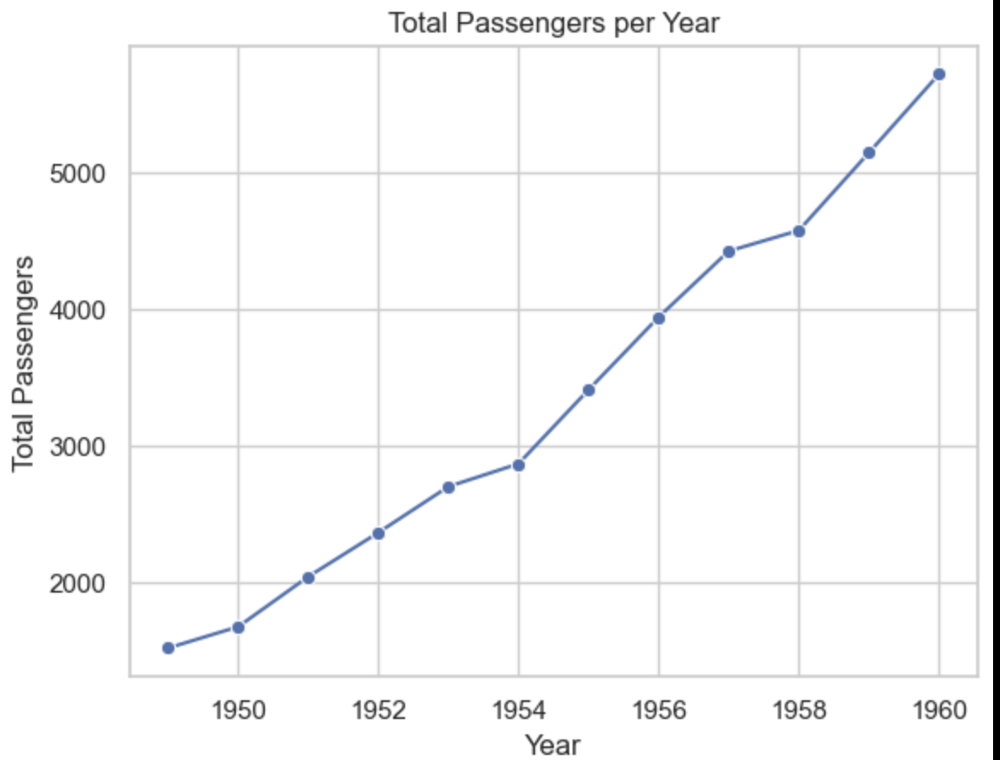

# ✈️ Flights Dataset EDA Project

## 👤 Author
Blessing Aganaga

## 📅 Date
June 2025

---

## Project Overview

This project showcases an **Exploratory Data Analysis (EDA)** of the [Seaborn Flights dataset](https://github.com/mwaskom/seaborn-data/blob/master/flights.csv).  
The dataset tracks the monthly number of international airline passengers from **1949 to 1960**.

The goal is to:
- Discover **seasonal trends** and **long-term growth** in air travel.
- Use **pandas**, **seaborn**, and **matplotlib** for data exploration and visualization.
- Practice storytelling through effective plots and summary insights.

---

## Environment Setup

The project uses a local virtual environment and the following packages:

- `pandas`
- `seaborn`
- `matplotlib`
- `jupyterlab`
- `pyarrow`

### Installation Steps

```bash
# Clone the repository
git clone https://github.com/teflxndxn/datafun-06-eda.git
cd datafun-06-eda

# Create a virtual environment
python -m venv .venv

# Activate the virtual environment
source .venv/bin/activate  # (Mac/Linux)
# or on Windows: .venv\Scripts\activate

# Install dependencies
pip install -r requirements.txt
```
 How to Run the Project
 # After activating your virtual environment
jupyter lab
This will launch JupyterLab in your browser.
Open your notebook and run the cells to explore the dataset and generate visualizations.

 # Skills Practiced

Data loading, cleaning, and exploration with pandas
Visualization with matplotlib and seaborn
Grouping and pivoting for time series analysis
Creating new features (e.g., renaming, transformation)
Communicating insights through visual storytelling

 # Visualizations Included

📈 Line Chart: Total airline passengers per year
📅 Bar Chart: Average monthly passengers
🌡️ Heatmap: Monthly passenger trends by year


 # Project Files

blessing_eda.ipynb – Main analysis notebook
requirements.txt – Project dependencies
.gitignore – Ignore unnecessary files
README.md – Project documentation


 # Dataset

Source: Seaborn Flights Dataset
Columns:
year: Year of observation
month: Month of observation
passengers: Number of airline passengers


 # Screenshot

 output from the analysis:




 # Git Workflow
git add .
git commit -m "Complete EDA and visualizations for Flights dataset"
git push


 # Project Status

Completed and pushed to GitHub
Visualizations render correctly
Notebook follows EDA structure